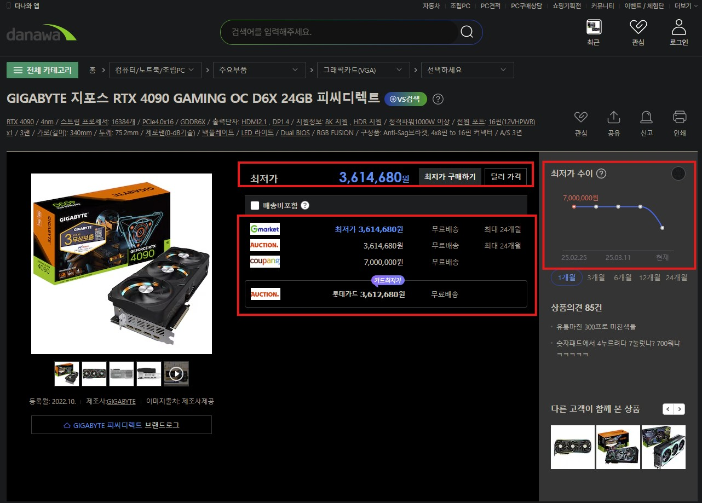

# Project SHA (Smart Hardware Advisor) 기획서

## 1. 프로젝트 개요

Project SHA (Smart Hardware Advisor)

Project SHA는 사용자에게 PC 하드웨어의 상태를 분석하고, 업그레이드 또는 최적화를 위한 추천을 제공하는 프로그램입니다. 이 프로젝트는 게임, 그래픽 작업, 데이터 분석 등 다양한 용도의 성능 최적화를 목표로 하며, 병목 현상 분석, 벤치마크 시뮬레이션 및 실시간 가격 정보를 제공하여 최적의 업그레이드 결정을 내릴 수 있도록 돕습니다.

**목표:**

- PC 조립과 업그레이드 과정에서 발생하는 정보의 난해함과 복잡함을 해결
- 사용자가 자신의 PC 하드웨어 상태를 한눈에 확인하고, 병목 현상 분석 및 특정 게임/작업 환경에서의 성능 예측을 통해 최적의 하드웨어 업그레이드를 결정하도록 지원

CPU-Z + Bottleneck test
EXAMPLE         
***                         ***


  
  
  
  
  
- 실시간 가격 정보(다나와, 쿠팡 등)와 연동해 최적의 구매 시점을 제안


**타깃 사용자:**

- PC 조립 초보자
- 3D 디자이너 및 콘텐츠 크리에이터
- 최신 게임 환경을 추구하는 코어 게이머
- 4K~8K 해상도 사용자 및 고성능 작업 환경을 원하는 전문가
- 가격 변동에 민감한 소비자

---

## 2. 문제 정의 및 필요성

- **정보 접근의 어려움:**
    - 다양한 하드웨어의 성능 정보와 벤치마크 데이터를 개별적으로 찾아야 하는 번거로움
    - 유튜브, 리뷰, 커뮤니티 등에서 흩어진 정보로 인해 결정이 어려움
- **병목 현상 파악의 복잡성:**
    - CPU, GPU, 메모리 등 각 부품의 성능이 상호 영향을 미치며, 어느 부분이 병목인지를 파악하기 어려움
- **실시간 가격 정보 미제공:**
    - 부품 가격은 빠르게 변동하지만, 이를 즉시 파악할 수 있는 도구가 부족함

---

## 3. 주요 기능 구성

1. **PC 하드웨어 정보 자동 분석**
    - CPU, GPU, 메모리, 저장 장치 등의 정보를 실시간으로 수집하여 터미널 또는 GUI 대시보드에 출력
    - **목적:** 사용자가 현재 시스템 상태를 빠르게 파악
2. **병목(Bottleneck) 현상 분석**
    - CPU와 GPU의 성능 비교를 통해 병목 구간을 시각적으로 표시
    - **목적:** 업그레이드가 필요한 부품을 빠르게 진단
3. **벤치마크 시뮬레이션 및 성능 예측**
    - 특정 게임 또는 작업 환경(해상도, 그래픽 옵션 등)에 따른 예상 성능(평균 FPS, 1% FPS 등)을 제공
    - **목적:** 사용자가 목표 성능에 도달하기 위한 개선 포인트를 명확히 이해
4. **최적 업그레이드 추천**
    - 병목 분석 결과와 성능 예측을 기반으로, 어떤 하드웨어를 업그레이드하면 효과적인지 추천
    - **목적:** 사용자의 투자 대비 최대 성능 개선 효과를 제공
5. **실시간 가격 비교 및 알림**
    - 다나와, 쿠팡 등의 쇼핑 플랫폼과 연동하여 부품 가격을 실시간으로 조회
    - 특정 부품 가격이 하락하면 알림 기능을 통해 통보
    - **목적:** 최적의 구매 시점 결정 지원
6. **리포트 생성 및 공유 기능**
    - 분석 결과 및 추천 내용을 PDF, 이미지 등으로 저장하거나 공유할 수 있도록 지원
7. **사용자 맞춤형 설정 및 프로파일**
    - 사용자의 PC 사양, 선호 게임 및 작업 환경을 저장해 맞춤형 추천 제공
8. **커뮤니티 연동**
    - 사용자들이 자신의 벤치마크 결과나 업그레이드 후기를 공유할 수 있는 기능
9. **실시간 모니터링 및 로그 기록**
    - 지속적으로 PC 상태를 모니터링하며, 변화 기록을 데이터베이스에 저장
10. **다크 모드 및 UI 커스터마이징**
    - 사용자 인터페이스(UI)를 다크 모드 등으로 자유롭게 커스터마이징할 수 있음
11. **API 제공 서비스**
    - 외부 개발자들이 시스템 데이터를 활용할 수 있도록 공개 API 지원
12. **가상 업그레이드 시뮬레이터**
    - 부품 교체 후 예상 성능 변화 시뮬레이션 기능
13. **멀티 OS 지원**
    - Windows 외 Linux 등 다양한 플랫폼에서도 기본 기능 지원

---

## 4. 기술 스택

- **프로그래밍 언어:** Python
- **주요 라이브러리:**
    - 시스템 정보: `psutil`, `cpuinfo`, `GPUtil`
    - 웹 크롤링: `requests`, `BeautifulSoup`, `Selenium`
    - 데이터 처리: `pandas`, `numpy`
    - GUI: `PyQt5` 또는 `Tkinter`
    - 시각화: `matplotlib`, `plotly`

### 시스템 정보 수집

- **CPU 정보**: `cpuinfo` 라이브러리를 사용하여 프로세서의 기본 정보(모델, 아키텍처 등)와 실제 작동 주파수 확인
- **메모리 정보**: `psutil` 라이브러리로 시스템의 총 메모리 및 사용 가능 메모리 정보를 실시간으로 수집
- **GPU 정보**: `GPUtil`을 사용하여 GPU의 이름, 메모리 사용량, 온도 등 주요 정보를 수집

### 웹 크롤링

- **가격 정보 크롤링**: 실시간으로 하드웨어 가격 정보를 수집하기 위해 `requests`와 `BeautifulSoup`을 사용하여 다양한 쇼핑몰 및 가격 비교 사이트에서 데이터를 추출
- **실시간 업데이트**: 웹사이트 변경 사항에 맞춰 자동으로 데이터 업데이트

### 데이터 처리 및 분석

- **병목 분석**: 하드웨어의 성능 지표를 기반으로 CPU, GPU, 메모리의 병목 현상을 실시간으로 분석
- **성능 예측**: 게임 및 작업별 예상 성능을 벤치마크 데이터와 비교하여 결과 제공

### GUI 개발

- **사용자 인터페이스**: `PyQt5` 또는 `Tkinter`로 직관적인 사용자 대시보드 제공
- **시각화**: `matplotlib`과 `plotly`를 사용하여 성능 데이터를 차트 형식으로 시각화

---

## 5. 개발 단계 및 일정

1. **사전 조사 및 요구사항 분석 (1~2주):**
    - 유사 프로그램(CPU-Z, Bottleneck Test) 분석
    - 타깃 사용자 인터뷰 및 요구사항 수집
    - 기능 명세서, 시스템 아키텍처 설계
2. **기본 모듈 개발 (3~4주):**
    - **하드웨어 정보 수집 모듈:** CPU, GPU, 메모리 등 정보 수집 및 출력
    - **병목 분석 모듈:** 성능 비교 알고리즘 구현
    - **벤치마크 시뮬레이션 모듈:** 간단한 규칙 기반 또는 ML 모델 적용
3. **고급 기능 개발 (4~6주):**
    - **업그레이드 추천 엔진:** 데이터베이스 연동 및 추천 알고리즘 개발
    - **실시간 가격 크롤러:** 웹 크롤링 또는 API 연동 구현 및 테스트
    - **UI/UX 디자인 및 대시보드 통합:** 사용자 친화적인 인터페이스 구현
4. **테스트 및 검증 (2~3주):**
    - 단위 테스트, 통합 테스트 수행
    - 베타 테스트를 통한 사용자 피드백 반영
5. **배포 및 유지보수 (지속적):**
    - PyInstaller 등으로 배포 패키지 제작
    - 자동 업데이트 및 피드백 기반 개선

---

## 6. 코드 예시

아래 코드는 시스템 정보를 수집하여 터미널에 출력하는 예시입니다.

각 줄마다 주석으로 동작 원리를 설명하여, 사용자가 로직을 쉽게 이해할 수 있도록 하였습니다.

```python
# 모듈 임포트: CPU 정보, 시스템 자원 및 GPU 정보를 수집하기 위한 라이브러리
import cpuinfo      # CPU 관련 정보를 가져오기 위한 라이브러리
import psutil       # 시스템의 메모리, CPU, 프로세스 등 자원 정보 수집
import GPUtil       # GPU 정보를 수집하기 위한 라이브러리

# ----------------- CPU 정보 수집 -----------------
# cpuinfo를 사용하여 현재 CPU 정보를 가져옵니다.
cpu_info = cpuinfo.get_cpu_info()  # CPU의 상세 정보 딕셔너리로 반환
# psutil을 사용하여 물리적 코어와 논리적 코어의 수를 가져옵니다.
physical_cores = psutil.cpu_count(logical=False)  # 물리적 코어 수
logical_cores = psutil.cpu_count(logical=True)      # 논리적 코어 수

# CPU 정보 출력
print("[CPU Information]")  # 섹션 제목 출력
print(f"Processor: {cpu_info.get('brand_raw', 'N/A')}")  # CPU 브랜드 및 모델명 출력
print(f"Architecture: {cpu_info.get('arch', 'N/A')}")      # CPU 아키텍처 출력
print(f"Cores: {physical_cores} physical, {logical_cores} logical")  # 코어 수 출력
print(f"Base Frequency: {cpu_info.get('hz_actual_friendly', 'N/A')}")  # 기본 클럭 주파수 출력
print("")  # 줄바꿈

# ----------------- 메모리 정보 수집 -----------------
# psutil을 사용하여 시스템 메모리 정보를 가져옵니다.
mem_info = psutil.virtual_memory()  # 메모리 정보 객체 반환
# 메모리 총 용량을 기가바이트 단위로 변환하여 출력합니다.
print("[Memory Information]")  # 섹션 제목 출력
print(f"Total Memory: {mem_info.total / (1024 ** 3):.2f} GB")  # 총 메모리 용량 출력
print("")  # 줄바꿈

# ----------------- GPU 정보 수집 -----------------
# GPUtil을 사용하여 현재 시스템의 GPU 정보를 리스트 형태로 가져옵니다.
gpus = GPUtil.getGPUs()  # 시스템에 연결된 GPU 목록 반환
print("[GPU Information]")  # 섹션 제목 출력
if not gpus:
    # GPU가 감지되지 않을 경우 메시지 출력
    print("No GPU detected")
else:
    # 감지된 GPU 각각에 대해 정보를 출력
    for gpu in gpus:
        print(f"GPU Name: {gpu.name}")  # GPU 이름 출력
        print(f"Driver Version: {gpu.driver}")  # GPU 드라이버 버전 출력
        print(f"Memory Total: {gpu.memoryTotal} MB")  # GPU 전체 메모리 출력
        print(f"Memory Free: {gpu.memoryFree} MB")  # 사용 가능한 메모리 출력
        print(f"Memory Used: {gpu.memoryUsed} MB")  # 사용 중인 메모리 출력
        print(f"Temperature: {gpu.temperature} °C")  # 현재 온도 출력
        print("")  # 줄바꿈

# ----------------- 병목(Bottleneck) 분석 예시 -----------------
def bottleneck_analysis(cpu_score, gpu_score):
    """
    CPU와 GPU의 벤치마크 점수를 비교하여 병목 현상을 판단하는 함수
    - cpu_score: CPU의 성능 점수 (예: Cinebench 결과)
    - gpu_score: GPU의 성능 점수 (예: 3DMark 결과)
    반환:
    - 문자열로 병목 현상 가능성에 대한 설명 반환
    """
    # 단순 비율을 사용한 예시 로직: 특정 임계값 이상이면 병목으로 판단
    ratio = cpu_score / gpu_score  # CPU와 GPU 점수의 비율 계산
    if ratio > 1.2:
        return "GPU 병목 가능성 높음"  # CPU에 비해 GPU 성능이 부족할 가능성
    elif ratio < 0.8:
        return "CPU 병목 가능성 높음"  # GPU에 비해 CPU 성능이 부족할 가능성
    else:
        return "균형 잡힌 시스템"  # 대체로 균형 있는 시스템

# 예시: 임의의 점lysis(cpu_benchmark_score, gpu_benchmark_score))  # 분석 결과 출력
print("")  # 줄바꿈

# ----------------- 가격 크롤링 (간단 예시) -----------------
import requests      # HTTP 요청을 위해 사용
from bs4 import BeautifulSoup  # HTML 파싱을 위해 사용

def get_price_from_url(url):
    """
    지정된 URL로부터 가격 정보를 추출하는 함수 (간단한 예시)
    - url: 제품 가격 정보를 담고 있는 웹 페이지 URL
    반환:
    - 가격 정보 문자열 (실제 선택자는 해당 사이트에 맞게 수정 필요)
    """
    # 웹 페이지 요청
    response = requests.get(url)
    # 응답 받은 HTML을 파싱
    soup = BeautifulSoup(response.text, 'html.parser')
    # 예시: 'price' 클래스를 가진 첫 번째 요소에서 텍스트 추출 (실제 HTML 구조에 맞게 수정)
    price = soup.find("span", {"class": "price"}).text
    return price

# 실제 URL은 각 쇼핑몰의 제품 페이지 URL로 교체 필요
sample_product_url = "https://example.com/product"  # 예시 URL
# 아래 출력은 실제 동작하는 URL이 있을 때 의미 있음
# print("[Price Information]")
# print(f"Current Price: {get_price_from_url(sample_product_url)}")

# ----------------- 결론 -----------------
"""
Project SHA는 PC 조립과 업그레이드에 있어 사용자가 직관적으로 시스템 성능을 파악하고,
최적의 업그레이드 방향을 제시받을 수 있도록 하는 혁신적인 도구입니다.
- 실시간 하드웨어 정보 수집, 병목 분석, 벤치마크 시뮬레이션을 통해 사용자는 자신의 PC 상태를 명확히 이해할 수 있습니다.
- 업그레이드 추천과 가격 크롤링 기능을 통해 효율적인 투자 결정을 지원합니다.
- 추가 기능(커뮤니티, 로그 기록, API 제공 등)을 통해 확장성을 고려한 미래 지향적 플랫폼입니다.
"""

# 위 코드는 각 기능의 핵심 동작 원리를 간략하게나마 보여주며,
# 실제 제품 개발 시 이와 유사한 모듈이 통합되어 동작하게 됩니다.
```

---

## 7. 기대 효과 및 향후 발전 방향

### 7.1 기대 효과

- **시간 절약**: 사용자들이 하드웨어 업그레이드에 필요한 정보를 빠르고 쉽게 얻을 수 있어 결정 시간이 단축됩니다.
- **비용 효율성**: 실시간 가격 정보를 제공하여 최적의 시점에 저렴한 가격으로 부품을 구입할 수 있도록 돕습니다.
- **성능 최적화**: 사용자 맞춤형 하드웨어 업그레이드 추천을 통해 시스템 성능을 최적화합니다.

### 7.2 향후 발전 방향

- **AI 기반 추천 시스템**: 머신러닝 모델을 도입하여 사용자 취향에 맞춘 더 정교한 추천 제공
- **글로벌 지원**: 다국어 지원 및 국제적인 하드웨어 가격 정보 통합
- **커뮤니티 연동**: 사용자 커뮤니티와의 연계를 통해 최신 정보를 공유하고 개선을 지속적으로 추진

---

## 8. 결론

Project SHA (Smart Hardware Advisor)는 PC 조립 및 업그레이드에 있어 사용자들이 겪는 어려움을 해결하고, 성능 최적화와 비용 효율성을 동시에 달성할 수 있는 종합 솔루션입니다.

정교한 하드웨어 정보 수집, 병목 분석, 벤치마크 시뮬레이션, 실시간 가격 조회 및 업그레이드 추천 기능을 통해, 다양한 소비층(PC 초보자, 코어 게이머, 전문가 등)에게 신뢰성 있는 정보를 제공할 것입니다.
